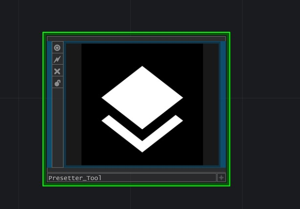

# TD-Presetter

Per-COMP-Preset TouchDesigner PlugIn. 

 

## Description

The Presetter is a utility tool for creating and recalling presets on COMPs. It is not a global preset manager or system. It stores a COMP's parameter names and values as presets on that COMP and exposes them via a Menu parameter on the COMP (or in the module—see Usage). Presets are stored in Python Storage, so saving the COMP as a .tox file also saves its presets.

## Installation

No installation required. Add the component by dragging and dropping the .tox file(s) into your project.

## Usage

Presetter can be used in two ways:

1. **Presetter_Tool.tox** — as a tool in the native TouchDesigner UI
   - Drag and drop `Presetter_Tool.tox` into your project.
   - A button is added to the bookmarks bar.
   - Clicking it adds the Presetter parameter page to the currently selected OP when that OP is a COMP.

2. **Presetter_Module.tox** — as a COMP
   - Use `Presetter_Module.tox` and set the Target OP parameter to the COMP you want to control.

